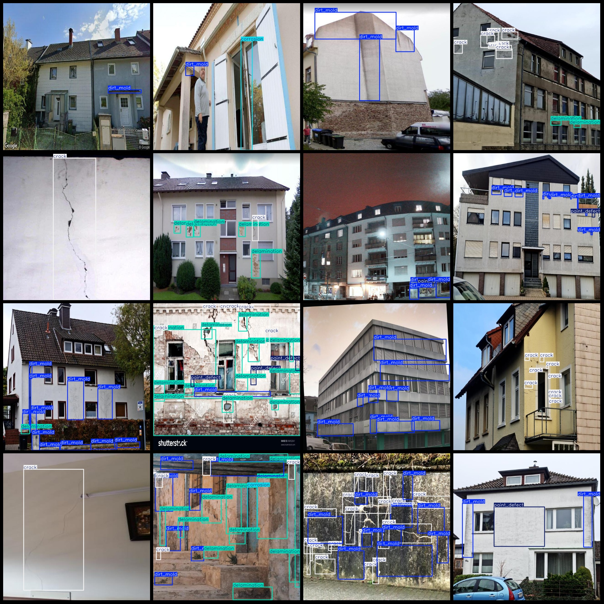
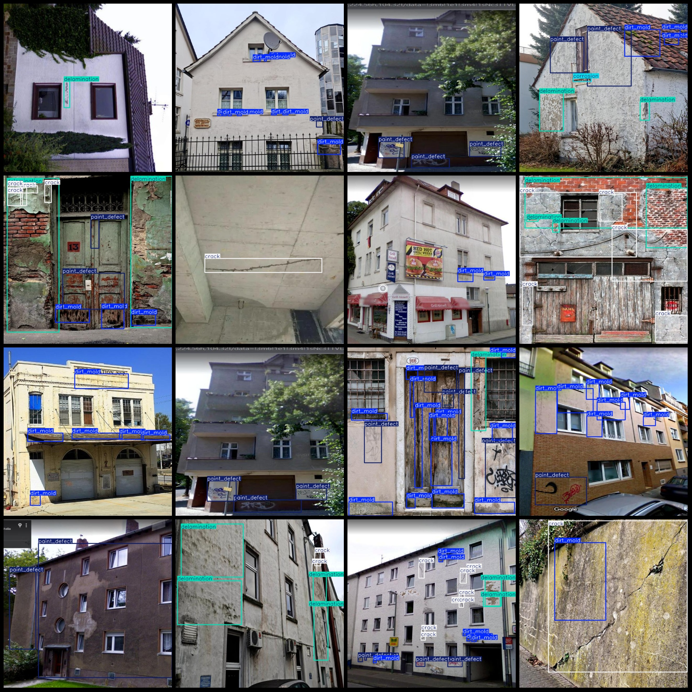

# Building Wall Surface Corrosion Crack Delamination Dirt Mold and Paint Defect Detection Dataset (VOC+YOLO) 1000 Images 5 Categories

Note: About half of the images in the dataset are enhanced.
Dataset format: Pascal VOC format + YOLO format (without split path txt files, only include jpg images and corresponding VOC format xml files and yolo format txt files).
Number of images (jpg file count): 1000
Number of annotations (xml file count): 1000
Number of annotations (txt file count): 1000
Number of categories: 5
Annotation category names: ["corrosion", "crack", "delamination", "dirt_mold", "paint_defect"]
Box count for each category:
- Corrosion box count = 352, occupying images = 108
- Crack box count = 1704, occupying images = 443
- Delamination box count = 1018, occupying images = 358
- Dirt mold box count = 2741, occupying images = 633
- Paint defect box count = 1724, occupying images = 489
Total box count: 7539
Image resolution: 640x640
Using labelImg for annotation
Annotation rules: Draw a rectangle around the category
Important note: The dataset does not have a training validation test split; you will need to do so yourself.
Special declaration: This dataset does not guarantee any accuracy in the trained models or weight files.
Image preview:
Annotated examples:
## Images

Here is a pay link on Stripe ( https://buy.stripe.com/3cs8yP7sY87d0vu9AB ). Please contact me lonlonago@foxmail.com after funding $89, and I will send you a complete data files , thank you!

